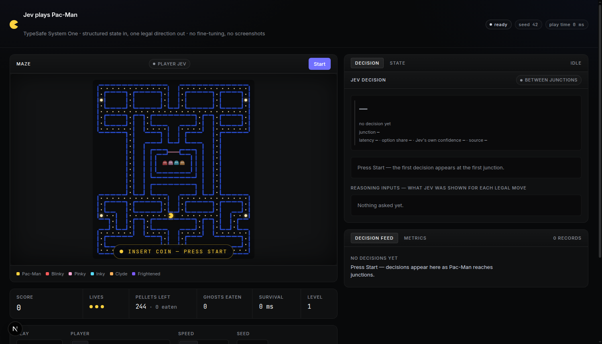

# Jev Plays Pac-Man

A live demo of [TypeSafe](https://docs.typesafe.ai)'s **Jev** model playing Pac-Man, one junction at a time.

Pac-Man runs down the corridors on his own. Every time he reaches a junction where more than one direction is open, the game asks Jev a single-choice question — `UP`, `DOWN`, `LEFT`, or `RIGHT`, limited strictly to legal directions — and he turns the way Jev says. Nothing else steers him.

```
game engine ── facts ──► observation ──► /api/decide ──► Jev ──► one legal direction ──► Pac-Man
     ▲                                                                                     │
     └───────────────────────── 60 Hz fixed timestep, never waits ─────────────────────────┘
```

Jev is asked roughly once a second, not sixty times: most tiles offer no choice at all.



## What is this, exactly?

- A **deterministic Pac-Man engine** (fixed 60 Hz simulation, seeded ghost behaviour) that computes facts: distances, dead ends, and how much safe room each direction leads into.
- A **decision layer** that turns the facts Pac-Man needs right now into a compact JSON observation and asks Jev to pick one of the legal directions.
- A **telemetry layer** that records every decision, including the ones that never arrived in time.

No fine-tuning, no reinforcement learning, and no memory of previous games. Each decision receives the current structured state and returns a single typed choice. It is a zero-shot real-time control demo: a System One model choosing between legal actions in a game it has never trained on.

## Architecture

```
lib/game/      engine: maze, movement, collisions, ghosts, pathfinding, candidate analysis, canvas rendering
lib/agent/     observation builder, candidate facts, the async controller, fallback, telemetry
lib/jev/       the question, the browser client, response validation
app/           page shell + /api/decide (the only place the API key is used)
components/    canvas stage, HUD, decision panel, feed, metrics, controls
tests/         engine, maze, movement, pathfinding, analysis, observation, controller, integration, live
```

The responsibilities are split on purpose:

| Code owns | Jev owns |
| --- | --- |
| walls, movement, collisions, pellets, ghost AI | which legal direction to take at a junction |
| distances, dead ends, danger, reachable area | — |
| applying the answer, or falling back if it is late | — |

Code never scores the moves against each other to overrule Jev. That would make the demo a lie: a heuristic would be playing, with Jev's answer used as decoration. If Jev answers in time and the direction is legal, that is the direction Pac-Man takes, full stop.

## Why structured state instead of screenshots?

Jev is a System One model: it is built to answer typed questions about program state, not to look at pictures. Pac-Man is never rendered to an image and never parsed back:

- the engine reports facts as numbers (`nearestDangerousGhostDistance: 9`, `deadEnd: false`, …);
- the observation carries only what a decision needs — score, lives, Pac-Man's tile and heading, the junction he is approaching, the ghosts, one block of facts per legal direction, and the last few decisions;
- the question offers exactly the legal directions as options, so Jev cannot answer "jump the wall".

Doing the arithmetic in code and the choosing in the model is the whole point. It also keeps each request small — one decision costs about 1,200 input tokens and 30 output tokens — and each answer comes back in roughly 200 ms.

## Setup

You need Node 20 or newer and a TypeSafe API key.

```sh
npm install
cp .env.example .env.local   # paste your key from https://console.typesafe.ai/keys
npm run dev                  # open http://localhost:3000
```

Press **Start**. Your key stays on the server (`app/api/decide/route.ts`) and is never sent to the browser.

| Setting in `.env.local` | Default | What it does |
| --- | --- | --- |
| `TYPESAFE_API_KEY` | none | Required for Jev mode. Without it, the app still runs and displays a notice. |
| `TYPESAFE_DEFAULT_MODEL` | `jev-latest` | Pin a version, e.g. `jev-1.13.0`, for repeatable runs. |
| `JEV_TIMEOUT_MS` | `2000` | Server-side request timeout. |
| `JEV_MOCK` | `false` | `true` answers from a deterministic stand-in, so the pipeline can be exercised without a key. |

## Controls

| Control | What it does |
| --- | --- |
| **Start / Pause** | Starts the run; pauses the simulation without losing the decision in flight. |
| **Restart** | New game, fresh epoch: everything in flight is discarded. |
| **Jev / Manual / Random / Heuristic** | Who plays. Any mode switch restarts the game with that player. |
| **0.5× / 1× / 2×** | Simulation speed. 0.5× is the default: three tiles of lookahead at 0.5× is a full second, which is comfortable for a 200 ms answer. |
| **Seed** | Fixes the ghost RNG. The same seed and the same decisions replay the same game. |
| **Debug** | `?debug=1`: draws tile coordinates, the target junction, candidate tiles, and ghost targets. |
| **Export JSON** | Downloads the whole session: seed, mode, summary metrics, and every decision. |
| **Arrow keys** | Steers Pac-Man in Manual mode. |
| **Sound** | Synthesized arcade audio: chomp, ghost, death, level-up. Silent until you press Start; remembers the setting. |
| **CRT** | Scanlines, vignette, and bezel on the maze. Off is a plain canvas. |
| **Konami code** | ↑↑↓↓←→←→BA turns on neon mode: the maze hue-cycles and nothing else changes. |

## How Jev decides

1. **Junctions only.** Three tiles before a junction, the controller works out which junction it is and which directions are real choices (the way back is not one).
2. **Facts, not suggestions.** For each legal direction, it computes the distance to the nearest pellet, how many pellets are within six tiles, the nearest power pellet, the nearest dangerous ghost, the nearest frightened ghost, reachable safe area, dead-end depth, and whether the move continues or reverses the heading.
3. **One question.** The observation and those facts go to `/api/decide`, which calls TypeSafe with a `choice` question whose options are exactly the legal directions. The option text repeats the same numbers in words.
4. **Applied at the junction.** The answer is held until Pac-Man is actually entering the junction, then taken. A direction applied earlier would take effect at the next tile centre, not at the junction.
5. **Late answers are thrown away.** Every request carries a decision ID and the game epoch. If the answer arrives after the junction, after a death, or after a restart, it is recorded as `STALE` and never applied.

You can watch all of this happen: the right-hand panel shows the probabilities, Jev's own confidence, the latency, and the exact facts each legal move was judged on; the **State** tab shows the raw JSON that was sent.

## Fallback behaviour

If no answer is in hand by the time Pac-Man is committed to the junction, the game must not stop — the simulation never waits for the network. It takes the simplest action that keeps him alive:

1. keep the current heading, if that is legal;
2. otherwise the only legal move;
3. otherwise the legal move that is furthest from the nearest dangerous ghost;
4. otherwise a fixed order: `UP`, `LEFT`, `DOWN`, `RIGHT`.

This is deliberately stupid. A clever fallback would be a second Pac-Man player, and the demo's claim is that Jev is playing. Every fallback is marked `FALLBACK` in the decision feed, and the fallback count is reported next to the applied count. The moment Jev starts answering again, he is back in charge.

## Metrics

The **Metrics** tab is computed from the decision records, not estimated:

- requests, applied, fallbacks, stale answers, timeouts, errors, invalid answers
- mean, p50, and p95 latency
- share of requests that ended up steering Pac-Man
- score, pellets eaten, ghosts eaten, survival time, level

One real 45-second session at 0.5× (`docs/example-session.json`, seed 42):

| | |
| --- | --- |
| score | 2,320 |
| pellets eaten | 197 of 244 |
| ghosts eaten | 1 |
| lives lost | 1 |
| decisions | 45 |
| applied by Jev | 40 (89%) |
| fallbacks | 4 |
| stale answers | 4 |
| errors / timeouts / invalid | 0 / 0 / 0 |
| latency | 262 ms mean, 238 ms p50, 551 ms p95 |

## Testing

```sh
npm test           # everything (the two live tests skip without a key)
npm run typecheck  # tsc --noEmit
npm run build      # production build
```

95 tests: maze validation, movement and turning rules, pellets and collisions, levels, BFS distances, candidate analysis, observation shape and answer validation, the controller's contract (normal, late, stale, restart, error, invalid, timeout), a latency sweep (0 / 100 / 300 / 700 / 1600 ms), a 10,000-tick invariant run with a seeded random player, eight tests for the juice layer (particles decay, trauma shake stays bounded, hit-stop freezes once and releases), and two live tests that talk to TypeSafe — one that checks a single answer, and one that plays a full game and writes a session report.

## Design

The interface is a dark data tool: near-black canvas, surfaces stacked by luminance, hairline translucent borders, one chromatic chrome accent (indigo), and colour reserved for data — Pac-Man amber, the maze blue, the four ghosts. Every token and the colour assignment live in `docs/design-system.md`.

Around that chrome the game is allowed to be a game: particles, score popups, trauma shake, and hit-stop live in `lib/game/juice.ts`, and `lib/audio/sfx.ts` synthesizes every sound with Web Audio, so the app ships zero media assets. Everything respects `prefers-reduced-motion`, sound never plays without a user gesture, and the optional CRT scanlines and the neon mode behind the Konami code (↑↑↓↓←→←→BA) are the cabinet's only jokes.

## Limitations

- **The maze is our own.** Nothing is copied from the arcade original: no ROM, no sprites, no original maze data.
- **Ghost AI is approximate.** The four ghosts chase, scatter, and turn frightened, but this is not a faithful recreation of the arcade personalities.
- **Levels repeat the same maze** with the pellets restored.
- **No replay mode in the UI.** Sessions export to JSON; replay is a scripted provider used by the tests.
- **One decision at a time.** A junction gets one request; there is no retry, because a retried decision is a stale decision.
- **Jev is not always right.** It plays a good game at 0.5×, and it dies when it misjudges a ghost.

## Not in this project, on purpose

Image recognition, screenshots, OCR, emulators, ROMs, online learning, reinforcement learning, LLM reasoning, vector stores, databases, authentication, multiplayer, mobile.

## License

[MIT](LICENSE)
